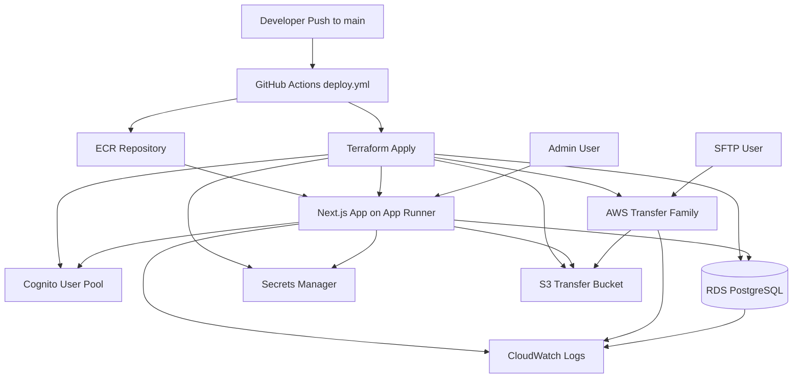

# navara-strategy

Next.js Operational Insights & Platform Health Portal with SFTP file-share hub, backed by PostgreSQL and AWS infrastructure.

## What this includes

### SFTP File Share Hub (`/upload`)

- Client upload hub with shadcn-style `Card`, `Input`, `Button`, and `Table` components.
- Upload API (`POST /api/files`) and list API (`GET /api/files`).
- PostgreSQL support via `DATABASE_URL` (RDS-ready). Falls back to local file metadata when no DB is configured.

### Operational Insights Portal (`/`)

A modern enterprise operational dashboard providing:

- **Dashboard** — Executive summary with real-time KPI metrics and Recharts visualizations
- **Tenant Management** — Multi-tenant administration with search and filtering
- **File Explorer** — Browse and inspect all uploaded files across tenants
- **Ingestion Jobs** — Monitor file processing pipeline and job statuses
- **Queue Monitoring** — SQS queue depths, throughput, and DLQ metrics
- **Failed Processing** — Review, diagnose, and retry failed ingestion records
- **Audit Logs** — Track all user actions and system events
- **Service Health** — Infrastructure and pipeline health monitoring (AWS, DB, Pipeline)
- **Database Insights** — Aurora PostgreSQL performance, connection pools, ACU scaling, IOPS
- **Settings** — Theme, notifications, data refresh configuration

### Technology Stack

| Layer          | Technology                                            |
| -------------- | ----------------------------------------------------- |
| Framework      | Next.js 16 (App Router)                               |
| Language       | TypeScript                                            |
| Styling        | TailwindCSS v4                                        |
| UI Components  | shadcn/ui-style (custom)                              |
| Data Fetching  | TanStack Query (30s polling)                          |
| Charts         | Recharts                                              |
| Authentication | NextAuth.js (Credentials provider)                    |
| RBAC           | Role-based (Super Admin, Admin, Tenant User, Auditor) |
| Database       | PostgreSQL / Aurora                                   |
| Infrastructure | Terraform (AWS)                                       |

### RBAC Strategy

| Role              | Permissions                                      |
| ----------------- | ------------------------------------------------ |
| Super Admin       | Full platform access, all tenants, system config |
| Admin             | Tenant management, file operations, reprocessing |
| Tenant User       | Own files, own ingestion status, own summaries   |
| Read-Only Auditor | View audit logs, view metrics (read-only)        |

### Observability

Reusable abstractions in `lib/observability.ts` supporting:

- Metric registry (counters, gauges, histograms)
- Structured logging with correlation IDs
- Distributed tracing context (OpenTelemetry-compatible)
- Ready for integration with Grafana, Prometheus, Datadog, New Relic

---

## Infrastructure Topology



---

## Local Development

### Prerequisites

- Node.js 20+
- npm 10+

```bash
cat > .env.local <<'EOF'
NEXT_PUBLIC_DEV_MODE=true
NEXTAUTH_SECRET=local-dev-secret
EOF
npm install
npm run dev
```

### Demo Accounts

| Email                | Role        | Password |
| -------------------- | ----------- | -------- |
| superadmin@navara.io | Super Admin | demo     |
| admin@navara.io      | Admin       | demo     |
| tenant@acme.com      | Tenant User | demo     |
| auditor@navara.io    | Auditor     | demo     |

---

## AWS Deployment

### Architecture

| Service               | Purpose                                                                         |
| --------------------- | ------------------------------------------------------------------------------- |
| **App Runner**        | Runs the containerised Next.js app (auto-scaling, HTTPS, no cluster management) |
| **ECR**               | Stores Docker images; lifecycle policy keeps the last 30                        |
| **RDS PostgreSQL 16** | Relational database; password auto-generated and stored in Secrets Manager      |
| **Secrets Manager**   | Holds `DATABASE_URL` and `NEXTAUTH_SECRET`; injected into App Runner at runtime |
| **S3**                | SFTP transfer bucket; versioning + SSE enabled; all public access blocked       |
| **Transfer Family**   | Managed SFTP endpoint backed by the S3 bucket                                   |
| **VPC**               | App Runner connected via VPC connector so it can reach RDS privately            |
| **CloudWatch**        | App Runner log group with configurable retention                                |

### Prerequisites

| Tool      | Min Version | Install                                                                       |
| --------- | ----------- | ----------------------------------------------------------------------------- |
| AWS CLI   | v2          | https://docs.aws.amazon.com/cli/latest/userguide/getting-started-install.html |
| Terraform | 1.6+        | https://developer.hashicorp.com/terraform/install                             |
| Docker    | 24+         | https://docs.docker.com/get-docker/                                           |

### Step 1 — Bootstrap remote Terraform state (once per AWS account)

Terraform state is stored in S3 with DynamoDB locking. Run these once:

```bash
AWS_REGION=us-east-1          # change if needed
PROJECT=navara-sftp           # must match project_name in tfvars

aws s3api create-bucket \
  --bucket "${PROJECT}-terraform-state" \
  --region "${AWS_REGION}" \
  --create-bucket-configuration LocationConstraint="${AWS_REGION}"
  # omit --create-bucket-configuration if region is us-east-1

aws s3api put-bucket-versioning \
  --bucket "${PROJECT}-terraform-state" \
  --versioning-configuration Status=Enabled

aws s3api put-bucket-encryption \
  --bucket "${PROJECT}-terraform-state" \
  --server-side-encryption-configuration \
    '{"Rules":[{"ApplyServerSideEncryptionByDefault":{"SSEAlgorithm":"AES256"}}]}'

aws dynamodb create-table \
  --table-name "${PROJECT}-terraform-locks" \
  --attribute-definitions AttributeName=LockID,AttributeType=S \
  --key-schema AttributeName=LockID,KeyType=HASH \
  --billing-mode PAY_PER_REQUEST \
  --region "${AWS_REGION}"
```

### Step 2 — Create an IAM role for GitHub Actions (OIDC, no long-lived keys)

```bash
ACCOUNT_ID=$(aws sts get-caller-identity --query Account --output text)
GITHUB_ORG=your-org          # your GitHub org or username
GITHUB_REPO=navara-strategy  # your repository name

# Create the OIDC provider (only needed once per account)
aws iam create-open-id-connect-provider \
  --url https://token.actions.githubusercontent.com \
  --client-id-list sts.amazonaws.com \
  --thumbprint-list 6938fd4d98bab03faadb97b34396831e3780aea1

# Create the trust-policy document
cat > /tmp/trust-policy.json <<EOF
{
  "Version": "2012-10-17",
  "Statement": [
    {
      "Effect": "Allow",
      "Principal": {
        "Federated": "arn:aws:iam::${ACCOUNT_ID}:oidc-provider/token.actions.githubusercontent.com"
      },
      "Action": "sts:AssumeRoleWithWebIdentity",
      "Condition": {
        "StringEquals": {
          "token.actions.githubusercontent.com:aud": "sts.amazonaws.com"
        },
        "StringLike": {
          "token.actions.githubusercontent.com:sub": "repo:${GITHUB_ORG}/${GITHUB_REPO}:ref:refs/heads/main"
        }
      }
    }
  ]
}
EOF

aws iam create-role \
  --role-name navara-github-deploy \
  --assume-role-policy-document file:///tmp/trust-policy.json

# Attach the minimum-required managed policies
aws iam attach-role-policy --role-name navara-github-deploy \
  --policy-arn arn:aws:iam::aws:policy/AmazonEC2ContainerRegistryPowerUser

aws iam attach-role-policy --role-name navara-github-deploy \
  --policy-arn arn:aws:iam::aws:policy/AWSAppRunnerFullAccess

# Terraform also needs IAM, RDS, S3, Secrets Manager, Transfer Family, CloudWatch
# Attach AdministratorAccess for simplicity, or scope it down to the services above
aws iam attach-role-policy --role-name navara-github-deploy \
  --policy-arn arn:aws:iam::aws:policy/AdministratorAccess
```

> **Scope down** `AdministratorAccess` to the exact services after initial rollout using the [IAM Access Analyzer policy generator](https://docs.aws.amazon.com/IAM/latest/UserGuide/access-analyzer-policy-generation.html).

### Step 3 — Generate an SSH key pair for the SFTP user

```bash
ssh-keygen -t ed25519 -C "navara-sftp-client" -f ~/.ssh/navara_sftp -N ""
cat ~/.ssh/navara_sftp.pub   # copy this value → SFTP_USER_PUBLIC_KEY secret
```

### Step 4 — Configure GitHub repository settings

#### Secrets (`Settings → Secrets and variables → Actions → Secrets`)

| Name                   | Value                                              |
| ---------------------- | -------------------------------------------------- |
| `AWS_DEPLOY_ROLE_ARN`  | `arn:aws:iam::<account>:role/navara-github-deploy` |
| `SFTP_USER_PUBLIC_KEY` | Contents of `~/.ssh/navara_sftp.pub`               |

#### Variables (`Settings → Secrets and variables → Actions → Variables`)

| Name             | Example value                        |
| ---------------- | ------------------------------------ |
| `AWS_REGION`     | `us-east-1`                          |
| `TF_STATE_BUCKET`| `navara-sftp-terraform-state`        |
| `TF_STATE_KEY`   | `production/terraform.tfstate`       |
| `TF_LOCK_TABLE`  | `navara-sftp-terraform-locks`        |
| `ECR_REPOSITORY` | `navara-sftp`                        |

`APPRUNNER_SERVICE_ARN` is optional and only needed when manually running `workflow_dispatch` with `skip_terraform=true`.

### Step 5 — Push to main

```bash
git push origin main
```

The `deploy.yml` workflow runs automatically:

1. **CI Gate** — lint, type-check, build
2. **Terraform Bootstrap** — creates/updates ECR repository so first deploy is unblocked
3. **Build & Push** — multi-stage Docker build → ECR (tagged with commit SHA + `latest`)
4. **Terraform Apply** — plans and applies full infrastructure with the new image URI
5. **Deploy** — triggers App Runner deployment and polls until `RUNNING`

Check progress in **Actions → Deploy to AWS**.

### Accessing the App

```bash
terraform -chdir=terraform output app_url
```

The App Runner service URL is the public HTTPS endpoint.

### Connecting via SFTP

```bash
# Get the Transfer Family endpoint
terraform -chdir=terraform output sftp_endpoint

sftp -i ~/.ssh/navara_sftp client-upload@<sftp_endpoint>
```

---

## Project Structure

```
app/
├── (dashboard)/          # Dashboard layout group
│   ├── layout.tsx        # Sidebar + providers
│   ├── page.tsx          # Executive dashboard
│   ├── tenants/          # Tenant management
│   ├── files/            # File explorer
│   ├── ingestion/        # Ingestion jobs
│   ├── queues/           # Queue monitoring
│   ├── failed/           # Failed processing
│   ├── audit/            # Audit logs
│   ├── health/           # Service health
│   ├── database/         # Database insights
│   └── settings/         # Settings
├── login/                # Authentication
├── upload/               # SFTP file upload hub
└── api/                  # API routes
components/
├── ui/                   # shadcn-style UI primitives
└── dashboard-sidebar.tsx # Navigation sidebar
lib/
├── auth.ts               # NextAuth config + RBAC
├── types.ts              # Shared TypeScript types
├── mock-data.ts          # Demo data generators
├── observability.ts      # Metrics, logging, tracing
├── theme.tsx             # Dark/light theme provider
├── query-provider.tsx    # TanStack Query provider
├── db.ts                 # PostgreSQL connection
├── files.ts              # File operations
└── utils.ts              # Utility functions
terraform/                # AWS infrastructure (Terraform)
.github/workflows/
├── ci.yml                # PR lint / type-check / build
└── deploy.yml            # Push-to-main deploy pipeline
Dockerfile                # Multi-stage production image
.env.local                # Local development environment values
```

---

## CI/CD Workflows

| Workflow     | Trigger             | Jobs                                                             |
| ------------ | ------------------- | ---------------------------------------------------------------- |
| `ci.yml`     | push / PR to `main` | Lint → Type-check → Build                                        |
| `deploy.yml` | push to `main`      | CI Gate → Terraform Bootstrap → Build+Push → Terraform Apply → Deploy |

The deploy workflow uses **GitHub OIDC** — no long-lived AWS access keys are stored.

---

## Future Expansion

The platform is architected to support:

- AI-based anomaly detection
- Intelligent ingestion validation
- Automated reconciliation
- Web-based uploads
- Analytics warehouse exports
- Real-time event streaming (SSE/WebSocket)
- MCP integrations
- RAG/document indexing
