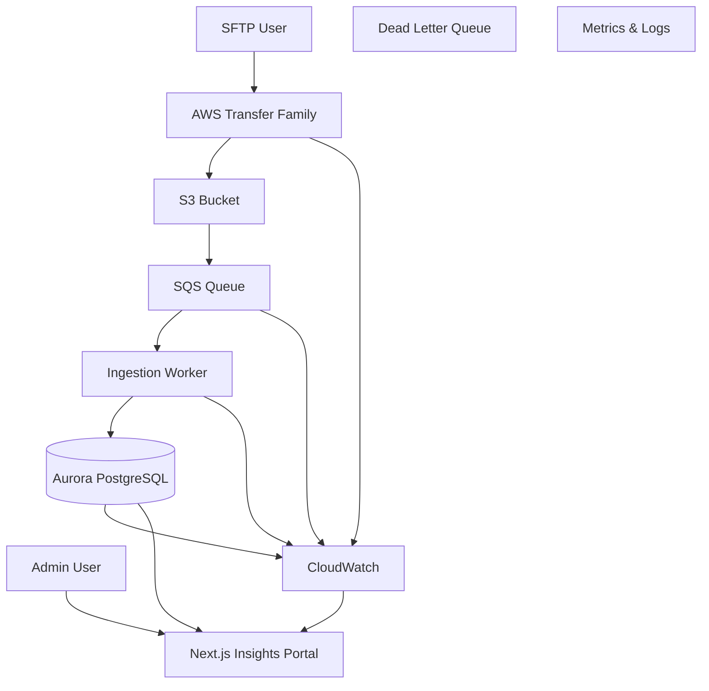

# navara-strategy

Next.js Operational Insights & Platform Health Portal with SFTP file-share hub, backed by PostgreSQL and AWS infrastructure.

## What this includes

### SFTP File Share Hub (`/upload`)

- Client upload hub with shadcn-style `Card`, `Input`, `Button`, and `Table` components.
- Upload API (`POST /api/files`) and list API (`GET /api/files`).
- PostgreSQL support via `DATABASE_URL` (RDS-ready). Falls back to local file metadata when no DB is configured.

### Operational Insights Portal (`/`)

A modern enterprise operational dashboard providing:

- **Dashboard** — Executive summary with real-time KPI metrics and Recharts visualizations
- **Tenant Management** — Multi-tenant administration with search and filtering
- **File Explorer** — Browse and inspect all uploaded files across tenants
- **Ingestion Jobs** — Monitor file processing pipeline and job statuses
- **Queue Monitoring** — SQS queue depths, throughput, and DLQ metrics
- **Failed Processing** — Review, diagnose, and retry failed ingestion records
- **Audit Logs** — Track all user actions and system events
- **Service Health** — Infrastructure and pipeline health monitoring (AWS, DB, Pipeline)
- **Database Insights** — Aurora PostgreSQL performance, connection pools, ACU scaling, IOPS
- **Settings** — Theme, notifications, data refresh configuration

### Technology Stack

| Layer | Technology |
|---|---|
| Framework | Next.js 16 (App Router) |
| Language | TypeScript |
| Styling | TailwindCSS v4 |
| UI Components | shadcn/ui-style (custom) |
| Data Fetching | TanStack Query (30s polling) |
| Charts | Recharts |
| Authentication | NextAuth.js (Credentials provider) |
| RBAC | Role-based (Super Admin, Admin, Tenant User, Auditor) |
| Database | PostgreSQL / Aurora |
| Infrastructure | Terraform (AWS) |

### RBAC Strategy

| Role | Permissions |
|---|---|
| Super Admin | Full platform access, all tenants, system config |
| Admin | Tenant management, file operations, reprocessing |
| Tenant User | Own files, own ingestion status, own summaries |
| Read-Only Auditor | View audit logs, view metrics (read-only) |

### Observability

Reusable abstractions in `lib/observability.ts` supporting:

- Metric registry (counters, gauges, histograms)
- Structured logging with correlation IDs
- Distributed tracing context (OpenTelemetry-compatible)
- Ready for integration with Grafana, Prometheus, Datadog, New Relic

## Infrastructure Topology



## Project Structure

```
app/
├── (dashboard)/          # Dashboard layout group
│   ├── layout.tsx        # Sidebar + providers
│   ├── page.tsx          # Executive dashboard
│   ├── tenants/          # Tenant management
│   ├── files/            # File explorer
│   ├── ingestion/        # Ingestion jobs
│   ├── queues/           # Queue monitoring
│   ├── failed/           # Failed processing
│   ├── audit/            # Audit logs
│   ├── health/           # Service health
│   ├── database/         # Database insights
│   └── settings/         # Settings
├── login/                # Authentication
├── upload/               # SFTP file upload hub
├── api/                  # API routes
│   ├── auth/             # NextAuth
│   ├── dashboard/        # Dashboard metrics
│   ├── tenants/          # Tenant data
│   ├── ingestion/        # Ingestion jobs
│   ├── queues/           # Queue metrics
│   ├── health/           # Service health
│   ├── audit/            # Audit logs
│   ├── database/         # DB metrics
│   ├── files/            # File operations
│   └── failed/           # Failed processing
components/
├── ui/                   # shadcn-style UI primitives
└── dashboard-sidebar.tsx # Navigation sidebar
lib/
├── auth.ts               # NextAuth config + RBAC
├── types.ts              # Shared TypeScript types
├── mock-data.ts          # Demo data generators
├── observability.ts      # Metrics, logging, tracing
├── theme.tsx             # Dark/light theme provider
├── query-provider.tsx    # TanStack Query provider
├── db.ts                 # PostgreSQL connection
├── files.ts              # File operations
└── utils.ts              # Utility functions
terraform/                # AWS infrastructure
```

## Local Development

```bash
npm install
npm run dev
```

### Demo Accounts

| Email | Role | Password |
|---|---|---|
| superadmin@navara.io | Super Admin | demo |
| admin@navara.io | Admin | demo |
| tenant@acme.com | Tenant User | demo |
| auditor@navara.io | Auditor | demo |

## Environment Variables

```bash
# Required for production
NEXTAUTH_SECRET=your-secret-key
NEXTAUTH_URL=https://your-domain.com
DATABASE_URL=******host:5432/db

# Optional
DATABASE_CA_CERT=...
DATABASE_SSL_REJECT_UNAUTHORIZED=false
MAX_UPLOAD_SIZE_MB=25
```

## Infrastructure (Terraform)

```bash
cd terraform
terraform init
cp terraform.tfvars.example terraform.tfvars
terraform plan
terraform apply
```

## CI/CD

GitHub Actions workflow (`.github/workflows/ci.yml`) runs:
- **Lint** — ESLint validation
- **Build** — Next.js production build
- **Type Check** — TypeScript strict checking

## Future Expansion

The platform is architected to support:

- AI-based anomaly detection
- Intelligent ingestion validation
- Automated reconciliation
- Web-based uploads
- Analytics warehouse exports
- Real-time event streaming (SSE/WebSocket)
- MCP integrations
- RAG/document indexing
