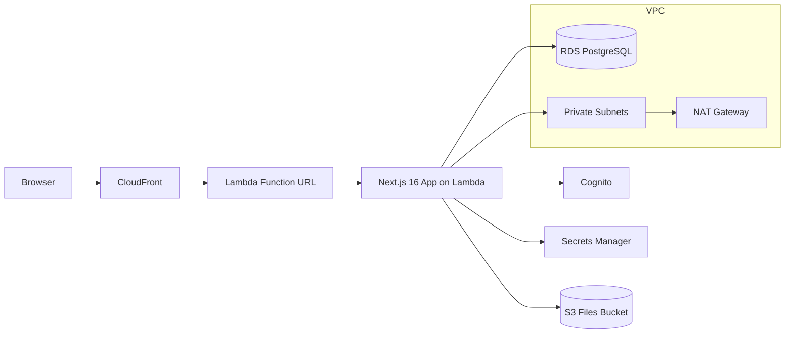

# navara-strategy

Secure file sharing portal built with Next.js and deployed to AWS Lambda (container image) behind CloudFront.

## Current Architecture


```mermaid
flowchart LR
    User[Browser] --> CF[CloudFront]
    CF --> LURL[Lambda Function URL]
    LURL --> L[Next.js 16 App on Lambda]

    L --> COG[Cognito]
    L --> SM[Secrets Manager]
    L --> RDS[(RDS PostgreSQL)]
    L --> S3[(S3 Files Bucket)]

    subgraph VPC
      PSN[Private Subnets]
      NAT[NAT Gateway]
      RDS
    end

    L --> PSN
    PSN --> NAT
```

Production URL: https://d2i0sz4mcgor37.cloudfront.net

## Portal Behavior

- Login-first experience.
- Main app route redirects to file portal.
- File portal route: /uploads
- Upload/list API: GET /api/files, POST /api/files
- Download API: GET /api/files/:id/download

Role behavior:

- Admin or super_admin: sees all files and can share to target users.
- tenant_user/read_only_auditor: sees own uploads and files shared to them.

## Authentication and Role Prerequisites

Auth stack:

- Production: NextAuth + AWS Cognito provider.
- Local dev: optional dev credentials provider when NEXT_PUBLIC_DEV_MODE=true.

Important current production role note:

- OAuth users are mapped from Cognito groups in [lib/auth.ts](lib/auth.ts).
- Supported group names are `super_admin`, `admin`, `tenant_user`, and `read_only_auditor`.
- Any Cognito user without a mapped group defaults to `tenant_user`.

Prerequisites to log in as Admin (production):

1. Cognito User Pool and app client are deployed by Terraform.
2. User exists in Cognito and has a confirmed password.
3. Callback/logout URLs include:

- https://d2i0sz4mcgor37.cloudfront.net/api/auth/callback/cognito
- https://d2i0sz4mcgor37.cloudfront.net/login

Prerequisites to log in as User (tenant_user):

1. For local testing: set NEXT_PUBLIC_DEV_MODE=true and use the demo user credentials in [lib/auth.ts](lib/auth.ts).
2. For production tenant role: add Cognito claim/group-to-role mapping in [lib/auth.ts](lib/auth.ts), then create a Cognito user assigned to that mapped role.

## Deploy Latest from Workstation (AWS CLI)

Prerequisites:

- AWS CLI v2
- Docker
- Terraform (tested with 1.6+)
- AWS profile configured (example used here: joey-navara)

1. Build and push a new Lambda image:

```powershell
$account = (aws sts get-caller-identity --profile joey-navara --query Account --output text).Trim()
$region = "us-east-1"
$repo = "$account.dkr.ecr.$region.amazonaws.com/navara-sftp"
$tag = "lambda-$(Get-Date -Format 'yyyyMMdd-HHmmss')"

aws ecr get-login-password --region $region --profile joey-navara |
  docker login --username AWS --password-stdin "$account.dkr.ecr.$region.amazonaws.com"

docker build -f Dockerfile.lambda -t "$repo`:$tag" .
docker push "$repo`:$tag"
```

2. Set image in [terraform/terraform.tfvars](terraform/terraform.tfvars):

```hcl
app_image_identifier = "<account>.dkr.ecr.us-east-1.amazonaws.com/navara-sftp:lambda-<timestamp>"
```

3. Terraform init/apply non-interactively:

```powershell
$tf = "C:\Users\<you>\AppData\Local\Microsoft\WinGet\Packages\Hashicorp.Terraform_Microsoft.Winget.Source_8wekyb3d8bbwe\terraform.exe"
$env:AWS_PROFILE = "joey-navara"

& $tf -chdir=terraform init -reconfigure \
  -backend-config="bucket=navara-sftp-terraform-state" \
  -backend-config="key=production/terraform.tfstate" \
  -backend-config="region=us-east-1" \
  -backend-config="dynamodb_table=navara-sftp-terraform-locks"

& $tf -chdir=terraform apply -auto-approve -var-file=terraform.tfvars
```

If Terraform cannot read profile credentials in your terminal session:

```powershell
$lines = aws configure export-credentials --profile joey-navara --format powershell
Invoke-Expression ($lines -join "`n")
```

Then re-run apply.

## Login Steps

Admin login (production):

1. Open https://d2i0sz4mcgor37.cloudfront.net/login
2. Click Sign in with Cognito.
3. Authenticate with a Cognito user.
4. You land on /uploads and can view/share files across users.

User login (local dev path):

1. Set NEXT_PUBLIC_DEV_MODE=true in .env.local.
2. Start app with npm run dev.
3. Open /login and use a demo tenant user from [lib/auth.ts](lib/auth.ts), such as tenant@acme.com / demo.
4. You land on /uploads and only see own uploads + admin-shared files.

## GitHub Actions Deployment Configuration

GitHub repository secrets required by [deploy.yml](.github/workflows/deploy.yml):

- `AWS_DEPLOY_ROLE_ARN`: `arn:aws:iam::911788523695:role/navara-github-deploy`
- `SFTP_USER_PUBLIC_KEY`: the public SSH key string for the Transfer Family user

GitHub repository variables required by [deploy.yml](.github/workflows/deploy.yml):

- `AWS_REGION`: `us-east-1`
- `ECR_REPOSITORY`: `navara-sftp`
- `TF_STATE_BUCKET`: `navara-sftp-terraform-state`
- `TF_STATE_KEY`: `production/terraform.tfstate`
- `TF_LOCK_TABLE`: `navara-sftp-terraform-locks`
- `COGNITO_DOMAIN`: `navara-sftp-911788523695`
- `APP_PUBLIC_URL`: `https://d2i0sz4mcgor37.cloudfront.net`
- `COGNITO_CALLBACK_URLS`: `["https://d2i0sz4mcgor37.cloudfront.net/api/auth/callback/cognito","http://localhost:3000/api/auth/callback/cognito"]`
- `COGNITO_LOGOUT_URLS`: `["https://d2i0sz4mcgor37.cloudfront.net/login","http://localhost:3000/login"]`

## Project Paths

- App shell and portal routes: [app](app)
- Login page: [app/login/page.tsx](app/login/page.tsx)
- File portal UI: [app/(dashboard)/uploads/page.tsx](<app/(dashboard)/uploads/page.tsx>)
- File APIs: [app/api/files/route.ts](app/api/files/route.ts), [app/api/files/[id]/download/route.ts](app/api/files/[id]/download/route.ts)
- Role/file access rules: [lib/files.ts](lib/files.ts)
- Auth configuration: [lib/auth.ts](lib/auth.ts)
- Terraform infra: [terraform/main.tf](terraform/main.tf), [terraform/variables.tf](terraform/variables.tf), [terraform/outputs.tf](terraform/outputs.tf), [terraform/terraform.tfvars](terraform/terraform.tfvars)
