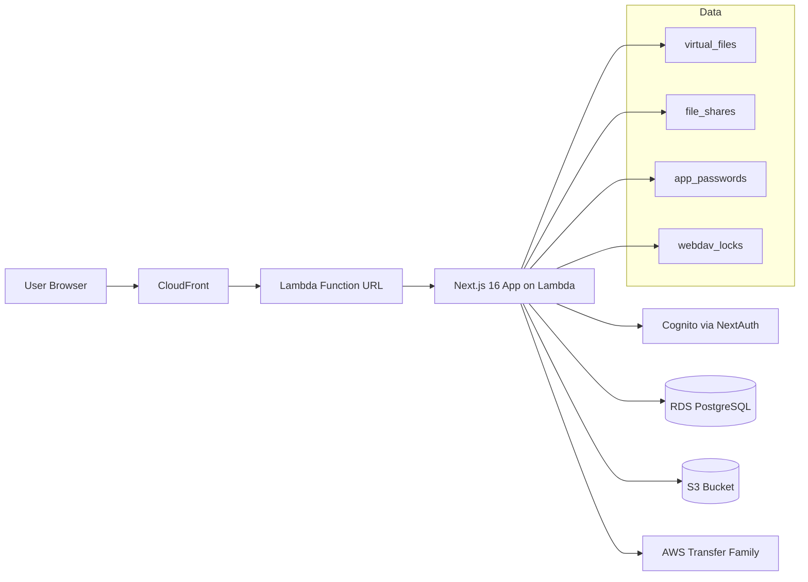

# navara-strategy

Secure file sharing portal built with Next.js and deployed to AWS Lambda (container image) behind CloudFront.

## App Architecture (Current)


```mermaid
flowchart LR
    U[User Browser] --> CF[CloudFront]
    CF --> LFU[Lambda Function URL]
    LFU --> APP[Next.js 16 App on Lambda]

    APP --> COG[Cognito via NextAuth]
    APP --> RDS[(RDS PostgreSQL)]
    APP --> S3[(S3 Bucket)]
    APP --> TF[AWS Transfer Family]

    subgraph Data
      VF[virtual_files]
      FS[file_shares]
      AP[app_passwords]
      WL[webdav_locks]
    end

    APP --> VF
    APP --> FS
    APP --> AP
    APP --> WL
```

Production URL: <https://d2i0sz4mcgor37.cloudfront.net>

### Runtime Components

- UI routes are in [app](app), with authenticated dashboard routes under [app/(dashboard)](<app/(dashboard)>).
- Root dashboard route redirects to `/uploads` in [app/(dashboard)/page.tsx](<app/(dashboard)/page.tsx>).
- Session/auth is handled by NextAuth in [lib/auth.ts](lib/auth.ts) with Cognito in production and optional dev credentials locally.
- File APIs:
  - Legacy shared files: [app/api/files/route.ts](app/api/files/route.ts)
  - Virtual file tree: [app/api/files/tree/route.ts](app/api/files/tree/route.ts)
  - Tree download: [app/api/files/tree/download/[id]/route.ts](app/api/files/tree/download/[id]/route.ts)
  - WebDAV endpoint: [app/api/dav/[...path]/route.ts](app/api/dav/[...path]/route.ts)
  - App passwords API: [app/api/settings/app-passwords/route.ts](app/api/settings/app-passwords/route.ts)
- Data access uses Prisma models in [prisma/schema.prisma](prisma/schema.prisma) and migrations in [prisma/migrations](prisma/migrations).

### RBAC Model

- Supported roles: `super_admin`, `admin`, `tenant_user`, `read_only_auditor`.
- Cognito groups are mapped to roles in [lib/auth.ts](lib/auth.ts).
- Unmapped Cognito users default to `tenant_user` for least-privilege behavior.

## Deploy Now (GitHub Actions)

Main deployment workflow: [.github/workflows/deploy.yml](.github/workflows/deploy.yml)

What it does:

1. CI gate (`lint`, `tsc`, `build`).
2. Terraform bootstrap for ECR (first-time and idempotent).
3. Build and push Lambda image to ECR.
4. Terraform plan/apply for infrastructure and app image update.
5. Prisma migrations (`prisma migrate deploy`) using DATABASE_URL from AWS Secrets Manager.

### Required Repository Secrets

- `AWS_DEPLOY_ROLE_ARN`
  - IAM role ARN used by OIDC in GitHub Actions.
- `SFTP_USER_PUBLIC_KEY`
  - Public SSH key for the AWS Transfer Family user provisioned by Terraform.

### Required Repository Variables

- `AWS_REGION`
  - Example: `us-east-1`
- `ECR_REPOSITORY`
  - Example: `navara-sftp`
- `TF_STATE_BUCKET`
  - Terraform backend bucket name.
- `TF_STATE_KEY`
  - Example: `production/terraform.tfstate`
- `TF_LOCK_TABLE`
  - DynamoDB lock table for Terraform state.
- `COGNITO_DOMAIN`
  - Cognito hosted UI domain prefix.
- `APP_PUBLIC_URL`
  - Public app URL (CloudFront), used for Auth.js URLs.
- `COGNITO_CALLBACK_URLS`
  - JSON list string, for example:
    `[
  "https://d2i0sz4mcgor37.cloudfront.net/api/auth/callback/cognito",
  "http://localhost:3000/api/auth/callback/cognito"
]`
- `COGNITO_LOGOUT_URLS`
  - JSON list string, for example:
    `[
  "https://d2i0sz4mcgor37.cloudfront.net/login",
  "http://localhost:3000/login"
]`

### Optional Repository Variable

- `DATABASE_URL_SECRET_ID`
  - Secrets Manager secret ID that stores `DATABASE_URL` for migration job.
  - Default in workflow: `navara-sftp/database-url`.
  - Set this variable if you use a different secret name.

### Current Values To Set In GitHub

Use these values with your current production configuration:

- `AWS_REGION=us-east-1`
- `ECR_REPOSITORY=navara-sftp`
- `TF_STATE_BUCKET=navara-sftp-terraform-state`
- `TF_STATE_KEY=production/terraform.tfstate`
- `TF_LOCK_TABLE=navara-sftp-terraform-locks`
- `COGNITO_DOMAIN=navara-sftp-911788523695`
- `APP_PUBLIC_URL=https://d2i0sz4mcgor37.cloudfront.net`
- `COGNITO_CALLBACK_URLS=["https://d2i0sz4mcgor37.cloudfront.net/api/auth/callback/cognito","http://localhost:3000/api/auth/callback/cognito"]`
- `COGNITO_LOGOUT_URLS=["https://d2i0sz4mcgor37.cloudfront.net/login","http://localhost:3000/login"]`
- `DATABASE_URL_SECRET_ID=navara-sftp/database-url` (optional but recommended)

Set these repository secrets:

- `AWS_DEPLOY_ROLE_ARN=<your-github-oidc-deploy-role-arn>`
- `SFTP_USER_PUBLIC_KEY=ssh-ed25519 AAAAC3NzaC1lZDI1NTE5AAAAIBwGGCfbU7p8aNMsmkANy57L3qCNbt1vWlJUfJys1o/r navara-sftp-client`

### tfvars To GitHub Mapping

- `aws_region` -> `AWS_REGION`
- `project_name` -> `ECR_REPOSITORY`
- `cognito_domain` -> `COGNITO_DOMAIN`
- `app_public_url` -> `APP_PUBLIC_URL`
- `cognito_callback_urls` -> `COGNITO_CALLBACK_URLS`
- `cognito_logout_urls` -> `COGNITO_LOGOUT_URLS`
- `transfer_user_public_key` -> `SFTP_USER_PUBLIC_KEY` (GitHub secret)

## Deploy from Workstation (Manual)

If you need manual fallback deployment:

1. Build and push image from [Dockerfile.lambda](Dockerfile.lambda).
2. Set `app_image_identifier` in [terraform/terraform.tfvars](terraform/terraform.tfvars).
3. Run `terraform apply` in [terraform](terraform).
4. Run Prisma migrations against production DB:

```powershell
$env:DATABASE_URL = (aws secretsmanager get-secret-value `
  --secret-id "navara-sftp/database-url" `
  --query SecretString --output text)
npx prisma migrate deploy
```

## Project Paths

- App routes: [app](app)
- Dashboard files UI: [app/(dashboard)/files/page.tsx](<app/(dashboard)/files/page.tsx>)
- Dashboard uploads UI: [app/(dashboard)/uploads/page.tsx](<app/(dashboard)/uploads/page.tsx>)
- Dashboard settings UI: [app/(dashboard)/settings/page.tsx](<app/(dashboard)/settings/page.tsx>)
- Login page: [app/login/page.tsx](app/login/page.tsx)
- Auth config: [lib/auth.ts](lib/auth.ts)
- File access rules: [lib/files.ts](lib/files.ts)
- Virtual file system logic: [lib/virtual-files.ts](lib/virtual-files.ts)
- App passwords: [lib/app-passwords.ts](lib/app-passwords.ts)
- WebDAV locks: [lib/webdav-locks.ts](lib/webdav-locks.ts)
- Terraform infra: [terraform/main.tf](terraform/main.tf)
