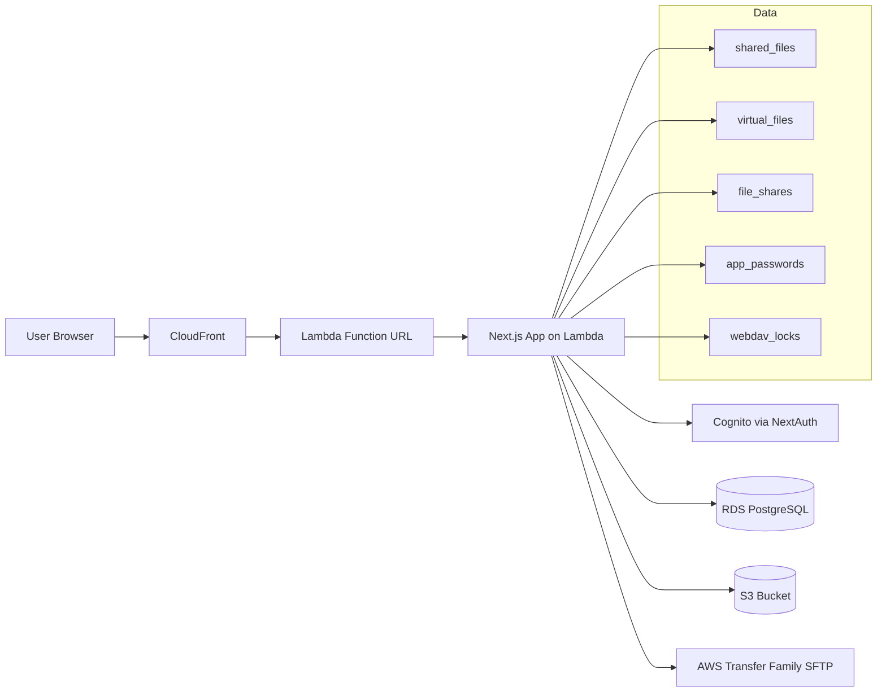

# navara-strategy

Secure file sharing portal built with Next.js 15, deployed to AWS Lambda (container image) behind CloudFront.

## Architecture


```mermaid
flowchart LR
    U[User Browser] --> CF[CloudFront]
    CF --> LFU[Lambda Function URL]
    LFU --> APP[Next.js App on Lambda]

    APP --> COG[Cognito via NextAuth]
    APP --> RDS[(RDS PostgreSQL)]
    APP --> S3[(S3 Bucket)]
    APP --> TF[AWS Transfer Family SFTP]

    subgraph Data
      SF[shared_files]
      VF[virtual_files]
      FS[file_shares]
      AP[app_passwords]
      WL[webdav_locks]
    end

    APP --> SF
    APP --> VF
    APP --> FS
    APP --> AP
    APP --> WL
```

Production URL: <https://d2i0sz4mcgor37.cloudfront.net>

### Runtime Components

- UI routes: [app](app). Authenticated dashboard routes under [app/(dashboard)](<app/(dashboard)>).
- Root dashboard redirects to `/uploads` via [app/(dashboard)/page.tsx](<app/(dashboard)/page.tsx>).
- Auth: NextAuth with Cognito in production, dev credentials locally — [lib/auth.ts](lib/auth.ts).
- File APIs:
  - Shared files (list + upload): [app/api/files/route.ts](app/api/files/route.ts)
  - Shared file download: [app/api/files/[id]/download/route.ts](app/api/files/[id]/download/route.ts)
  - Virtual file tree: [app/api/files/tree/route.ts](app/api/files/tree/route.ts)
  - Tree download: [app/api/files/tree/download/[id]/route.ts](app/api/files/tree/download/[id]/route.ts)
  - WebDAV endpoint: [app/api/dav/[...path]/route.ts](app/api/dav/[...path]/route.ts)
  - App passwords: [app/api/settings/app-passwords/route.ts](app/api/settings/app-passwords/route.ts)
  - Connection info (SFTP + WebDAV details): [app/api/settings/connection-info/route.ts](app/api/settings/connection-info/route.ts)
- Prisma schema: [prisma/schema.prisma](prisma/schema.prisma). Migrations: [prisma/migrations](prisma/migrations).

### RBAC Model

Supported roles: `super_admin`, `admin`, `tenant_user`, `read_only_auditor`. Cognito groups are mapped to roles in [lib/auth.ts](lib/auth.ts). Unmapped users default to `tenant_user`.

---

## CI/CD — Push to Main

**Pushing to `main` automatically runs the full deploy pipeline** via [.github/workflows/deploy.yml](.github/workflows/deploy.yml). No manual steps needed for normal deployments.

### Pipeline Sequence

```
push to main
     │
     ▼
┌─────────────────────────────────────────────────────────┐
│ 1. CI Gate                                              │
│    lint → tsc --noEmit → next build                     │
│    Fails fast — nothing deploys if CI fails             │
└──────────────────────┬──────────────────────────────────┘
                       │
                       ▼
┌─────────────────────────────────────────────────────────┐
│ 2. Terraform Bootstrap (ECR)                            │
│    terraform apply -target=aws_ecr_repository.app       │
│    Idempotent — safe to run every deploy                │
│    Ensures ECR exists before the image build step       │
└──────────────────────┬──────────────────────────────────┘
                       │
                       ▼
┌─────────────────────────────────────────────────────────┐
│ 3. Build & Push Image                                   │
│    docker build -f Dockerfile.lambda                    │
│    Tags: :<sha-short>  and  :latest                     │
│    Pushes both tags to ECR                              │
└──────────────────────┬──────────────────────────────────┘
                       │
                       ▼
┌─────────────────────────────────────────────────────────┐
│ 4. Terraform Apply (full infra)                         │
│    terraform plan → terraform apply                     │
│    Updates Lambda image_uri to the new :<sha> tag       │
│    Creates/updates: Lambda, RDS, Cognito, CloudFront,   │
│      S3, Transfer Family, CodeBuild, IAM, VPC, NAT      │
│    No-op if nothing changed (plan exit 0)               │
└──────────────────────┬──────────────────────────────────┘
                       │
                       ▼
┌─────────────────────────────────────────────────────────┐
│ 5. Prisma Migrate (CodeBuild in VPC)                    │
│    Starts aws_codebuild_project.db_migrate              │
│    Runs inside private VPC subnets → reaches RDS        │
│    git clone at exact $GITHUB_SHA                       │
│    npx prisma migrate deploy                            │
│    No-op if there are no pending migrations             │
└─────────────────────────────────────────────────────────┘
```

- The `concurrency: group: deploy-production` lock prevents overlapping deploys. In-flight runs are **never** cancelled.
- [.github/workflows/ci.yml](.github/workflows/ci.yml) is a **PR gate only** — runs lint/typecheck/build on every pull request to `main`. It does not trigger on pushes (deploy.yml handles those).

### Required Repository Secrets

| Secret                 | Description                                                                                 |
| ---------------------- | ------------------------------------------------------------------------------------------- |
| `AWS_DEPLOY_ROLE_ARN`  | IAM role ARN assumed via OIDC (output of `terraform output github_actions_deploy_role_arn`) |
| `SFTP_USER_PUBLIC_KEY` | Public SSH key for the AWS Transfer Family SFTP user                                        |

### Required Repository Variables

| Variable                 | Production Value                                                                                                        |
| ------------------------ | ----------------------------------------------------------------------------------------------------------------------- |
| `AWS_REGION`             | `us-east-1`                                                                                                             |
| `ECR_REPOSITORY`         | `navara-sftp`                                                                                                           |
| `TF_STATE_BUCKET`        | `navara-sftp-terraform-state`                                                                                           |
| `TF_STATE_KEY`           | `production/terraform.tfstate`                                                                                          |
| `TF_LOCK_TABLE`          | `navara-sftp-terraform-locks`                                                                                           |
| `COGNITO_DOMAIN`         | `navara-sftp-911788523695`                                                                                              |
| `APP_PUBLIC_URL`         | `https://d2i0sz4mcgor37.cloudfront.net`                                                                                 |
| `COGNITO_CALLBACK_URLS`  | `["https://d2i0sz4mcgor37.cloudfront.net/api/auth/callback/cognito","http://localhost:3000/api/auth/callback/cognito"]` |
| `COGNITO_LOGOUT_URLS`    | `["https://d2i0sz4mcgor37.cloudfront.net/login","http://localhost:3000/login"]`                                         |
| `DATABASE_URL_SECRET_ID` | `navara-sftp/database-url` _(optional, this is the default)_                                                            |

Set these as repository **secrets**:

```
AWS_DEPLOY_ROLE_ARN=<your-github-oidc-deploy-role-arn>
SFTP_USER_PUBLIC_KEY=ssh-ed25519 AAAAC3NzaC1lZDI1NTE5AAAAIBwGGCfbU7p8aNMsmkANy57L3qCNbt1vWlJUfJys1o/r navara-sftp-client
```

---

## First-Time Bootstrap

The OIDC IAM role that GitHub Actions uses is itself managed by Terraform. Bootstrap once from a workstation with AWS credentials:

```powershell
cd terraform

terraform init `
  -backend-config="bucket=navara-sftp-terraform-state" `
  -backend-config="key=production/terraform.tfstate" `
  -backend-config="region=us-east-1" `
  -backend-config="dynamodb_table=navara-sftp-terraform-locks"

terraform apply `
  -var="app_image_identifier=public.ecr.aws/docker/library/node:22-alpine" `
  -var="transfer_user_public_key=<SFTP_PUBLIC_KEY>"
```

Copy the `github_actions_deploy_role_arn` output and set it as the `AWS_DEPLOY_ROLE_ARN` repository secret. All subsequent deploys run fully automated via push to `main`.

> The Terraform state S3 bucket and DynamoDB lock table must exist before `terraform init`. Create them once manually via the AWS console or CLI, then Terraform manages everything else.

---

## Adding Database Migrations

1. Edit [prisma/schema.prisma](prisma/schema.prisma).
2. Generate locally: `npx prisma migrate dev --name <migration_name>`
3. Commit the generated file under `prisma/migrations/`.
4. Push to `main`. The pipeline runs `prisma migrate deploy` inside the VPC automatically.

---

## Manual Fallback Deployment

If you need to deploy without GitHub Actions:

```powershell
# 1. Build and push image
$SHA = git rev-parse --short HEAD
$ACCOUNT = aws sts get-caller-identity --query Account --output text
$ECR = "$ACCOUNT.dkr.ecr.us-east-1.amazonaws.com/navara-sftp"
aws ecr get-login-password --region us-east-1 | docker login --username AWS --password-stdin $ECR
docker build -f Dockerfile.lambda -t "$ECR:$SHA" -t "$ECR:latest" .
docker push "$ECR:$SHA"
docker push "$ECR:latest"

# 2. Apply Terraform
cd terraform
terraform apply `
  -var="app_image_identifier=$ECR`:$SHA" `
  -var="transfer_user_public_key=<KEY>"

# 3. Run migrations (requires network access to RDS — use VPC-connected machine)
$env:DATABASE_URL = (aws secretsmanager get-secret-value `
  --secret-id "navara-sftp/database-url" `
  --query SecretString --output text)
npx prisma migrate deploy
```

---

## tfvars → GitHub Variables Mapping

| Terraform variable         | GitHub variable                 |
| -------------------------- | ------------------------------- |
| `aws_region`               | `AWS_REGION`                    |
| `project_name`             | `ECR_REPOSITORY`                |
| `cognito_domain`           | `COGNITO_DOMAIN`                |
| `app_public_url`           | `APP_PUBLIC_URL`                |
| `cognito_callback_urls`    | `COGNITO_CALLBACK_URLS`         |
| `cognito_logout_urls`      | `COGNITO_LOGOUT_URLS`           |
| `transfer_user_public_key` | `SFTP_USER_PUBLIC_KEY` (secret) |

---

## Project Paths

| Path                                                                                   | Purpose                                              |
| -------------------------------------------------------------------------------------- | ---------------------------------------------------- |
| [app](app)                                                                             | All Next.js routes                                   |
| [app/(dashboard)/files/page.tsx](<app/(dashboard)/files/page.tsx>)                     | Dashboard — virtual file tree UI                     |
| [app/(dashboard)/uploads/page.tsx](<app/(dashboard)/uploads/page.tsx>)                 | Dashboard — shared-file upload / inbox UI            |
| [app/(dashboard)/settings/page.tsx](<app/(dashboard)/settings/page.tsx>)               | Settings — app passwords + connection info           |
| [app/upload/page.tsx](app/upload/page.tsx)                                             | Standalone file-share hub (outside dashboard layout) |
| [app/login/page.tsx](app/login/page.tsx)                                               | Login page                                           |
| [app/api/files/route.ts](app/api/files/route.ts)                                       | List / upload shared files                           |
| [app/api/files/[id]/download/route.ts](app/api/files/[id]/download/route.ts)           | Download a shared file by ID                         |
| [app/api/files/tree/route.ts](app/api/files/tree/route.ts)                             | Virtual file tree (CRUD + sharing)                   |
| [app/api/files/tree/download/[id]/route.ts](app/api/files/tree/download/[id]/route.ts) | Download a virtual-tree file by ID                   |
| [app/api/dav/[...path]/route.ts](app/api/dav/[...path]/route.ts)                       | WebDAV endpoint                                      |
| [app/api/settings/app-passwords/route.ts](app/api/settings/app-passwords/route.ts)     | App password CRUD                                    |
| [app/api/settings/connection-info/route.ts](app/api/settings/connection-info/route.ts) | SFTP + WebDAV connection details                     |
| [components/file-share-hub.tsx](components/file-share-hub.tsx)                         | Shared-files upload / download UI                    |
| [components/file-manager-console.tsx](components/file-manager-console.tsx)             | Virtual file tree UI                                 |
| [components/dashboard-sidebar.tsx](components/dashboard-sidebar.tsx)                   | Navigation sidebar                                   |
| [lib/auth.ts](lib/auth.ts)                                                             | NextAuth + Cognito config                            |
| [lib/files.ts](lib/files.ts)                                                           | Shared-file access rules                             |
| [lib/virtual-files.ts](lib/virtual-files.ts)                                           | Virtual file system logic                            |
| [lib/app-passwords.ts](lib/app-passwords.ts)                                           | App password management                              |
| [lib/webdav-locks.ts](lib/webdav-locks.ts)                                             | WebDAV lock support                                  |
| [lib/query-provider.tsx](lib/query-provider.tsx)                                       | TanStack Query client provider                       |
| [lib/mock-data.ts](lib/mock-data.ts)                                                   | Mock data for local development                      |
| [lib/observability.ts](lib/observability.ts)                                           | Metrics + tracing abstractions                       |
| [lib/anomaly-detection.ts](lib/anomaly-detection.ts)                                   | Anomaly detection engine                             |
| [lib/reconciliation.ts](lib/reconciliation.ts)                                         | Data reconciliation engine                           |
| [lib/ingestion-validation.ts](lib/ingestion-validation.ts)                             | Ingestion validation rules engine                    |
| [Dockerfile.lambda](Dockerfile.lambda)                                                 | Lambda container image                               |
| [terraform/main.tf](terraform/main.tf)                                                 | All AWS infrastructure                               |
| [prisma/schema.prisma](prisma/schema.prisma)                                           | Database schema                                      |
| [prisma/migrations](prisma/migrations)                                                 | Migration history                                    |
| [.github/workflows/deploy.yml](.github/workflows/deploy.yml)                           | Full CI/CD deploy pipeline                           |
| [.github/workflows/ci.yml](.github/workflows/ci.yml)                                   | PR-only CI gate                                      |
